# 概述

基于Boshs 2.6.2，采用c语言和nasm汇编语言编写，利用cpu提供的机制（中断，页表，保护模式，tss...)，实现了对文件，内存，线程/进程，权限的基本管理功能

实现的函数有：malloc,free,printf,fork,execv,exit/wait.....

c语言和汇编语言遵循cdecl调用约定，采用ELF文件格式

最终提供shell交互功能

# 内存管理

## 二级页表

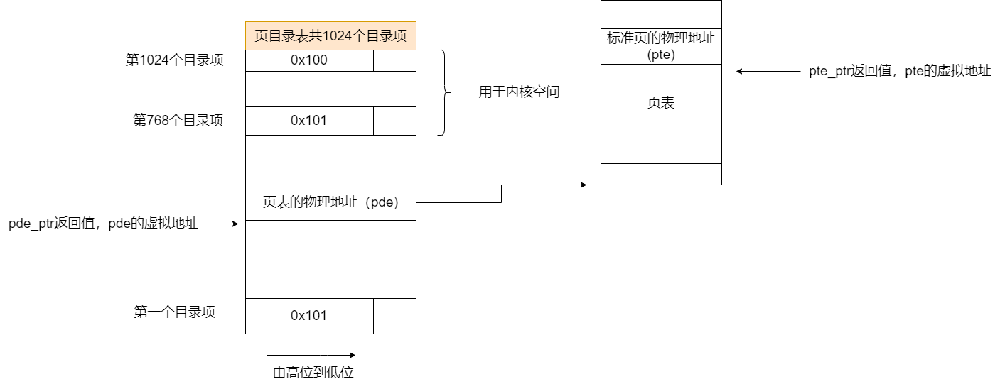

## 内存池

mem_block的大小（0,16,32....1024),采用链表进行管理，提高内存利用率和管理效率

对于大于1024的内存块，直接申请和释放

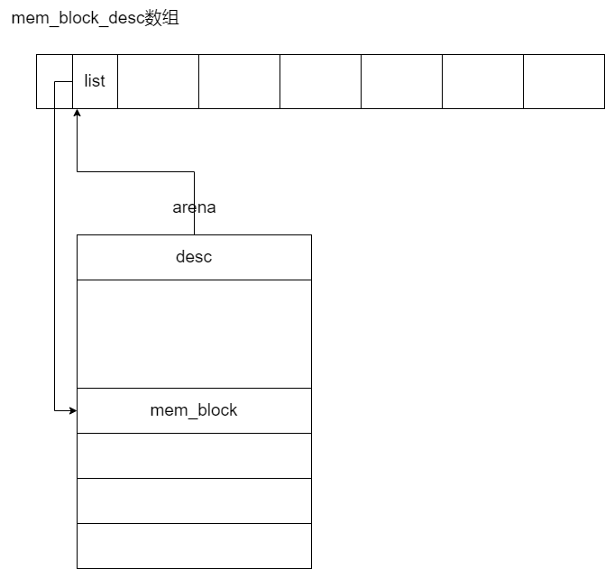

# 文件系统

## 分区布局

采用了inode作为文件控制数据结构，数据的第一个扇区是根目录

## 文件描述符

文件表和inode队列都是全局的符号

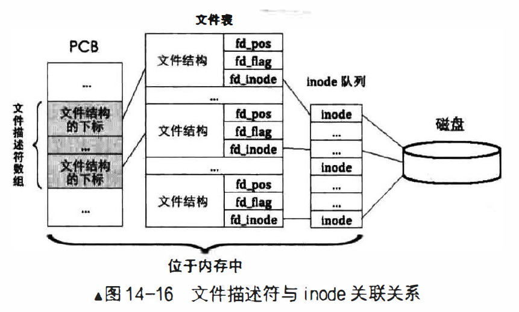

# 线程/进程

## pcb的结构

每个线程都有位于内核空间的pcb

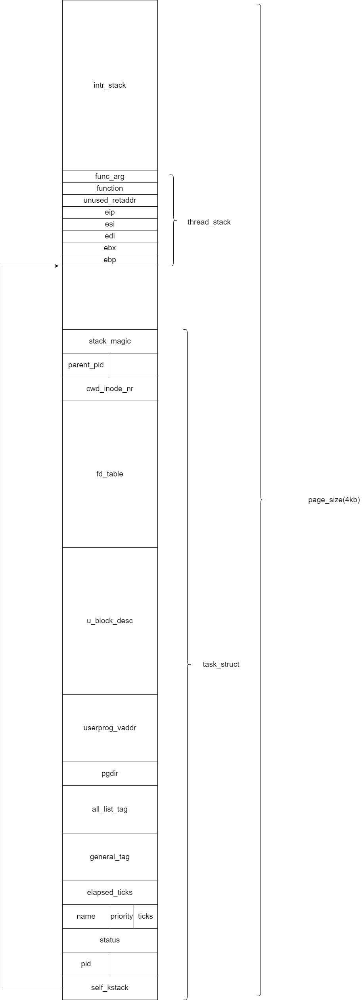

## 调度流程

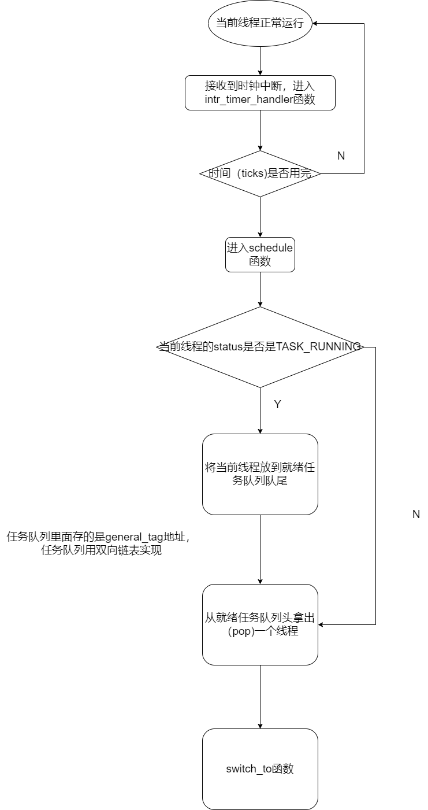

### 上下文的保存与切换

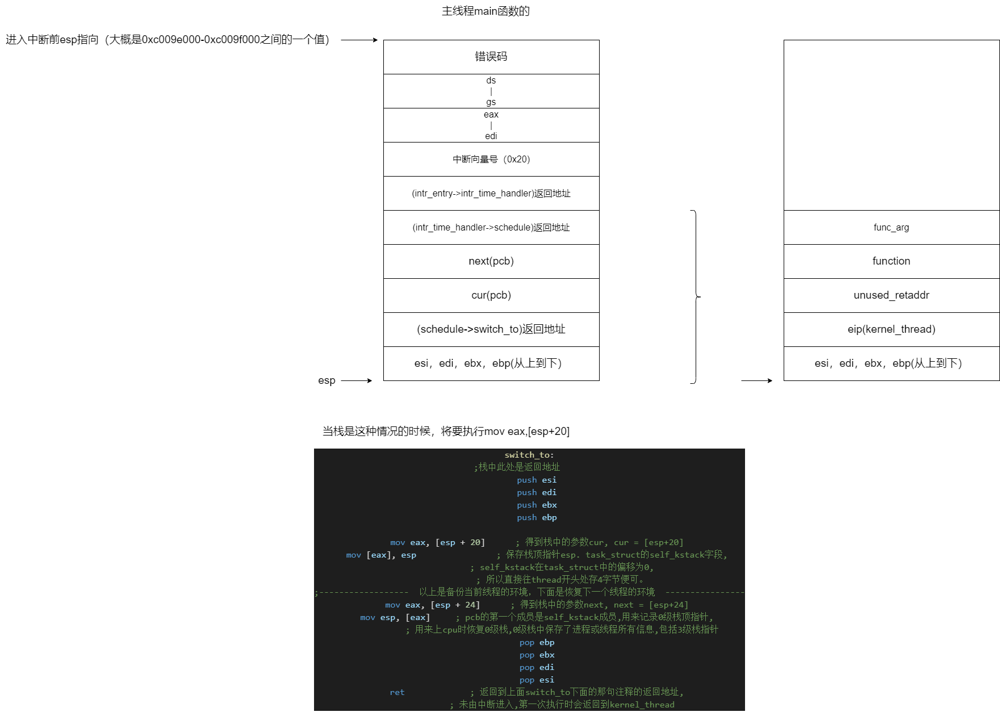

## 特权的变换（门）

特权主要体现在cs eip ss esp寄存器上，在实现了tss结构后，利用中断门从ring3->ring0,利用iret从ring0->ring3

系统调用则封装了这一过程

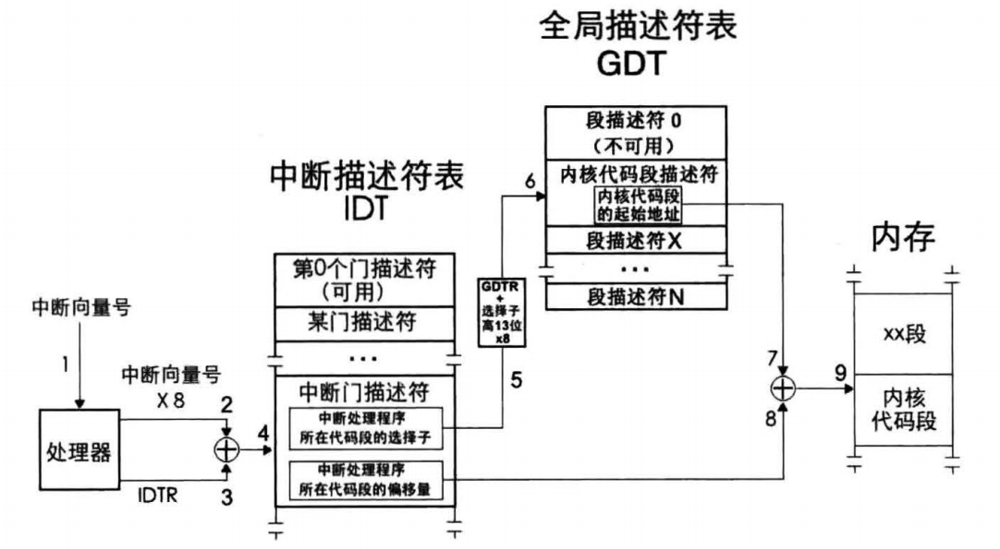

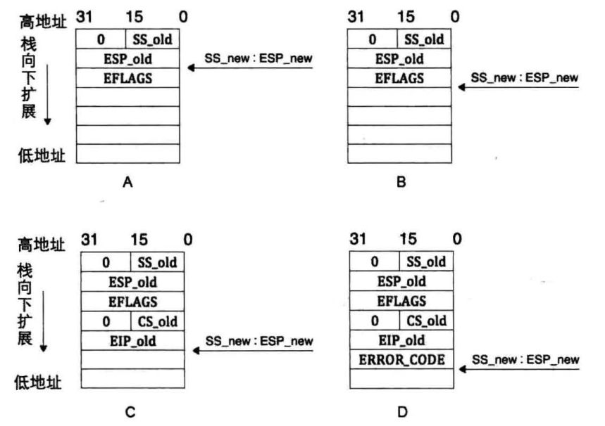

## 锁机制

利用信号量来实现

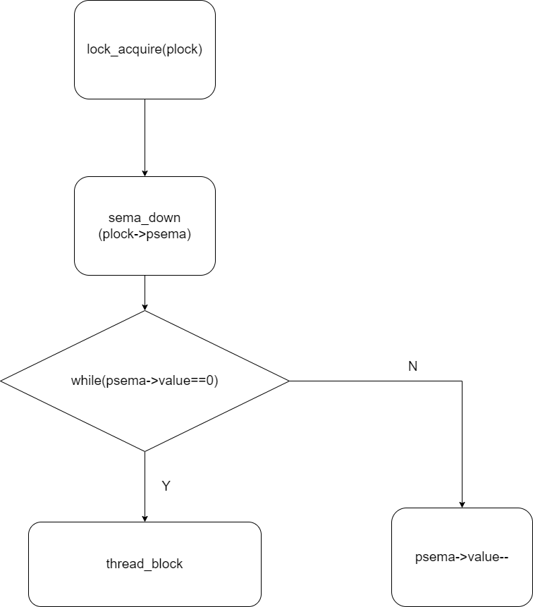

# 系统交互

## fork

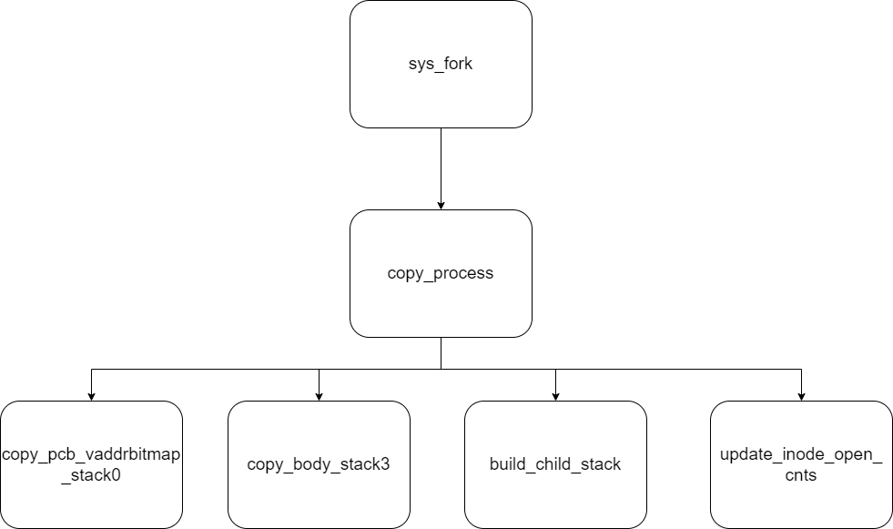

## init

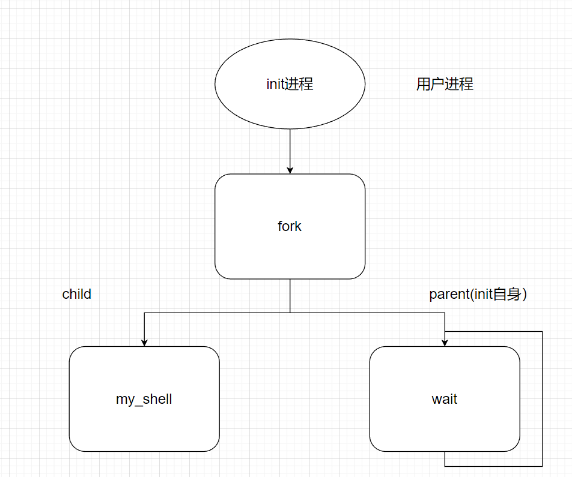

## shell

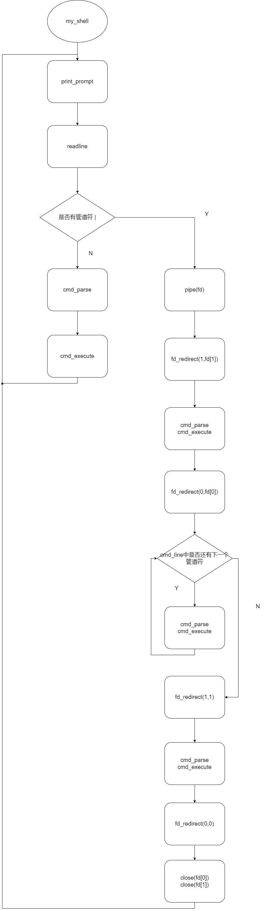

## execve

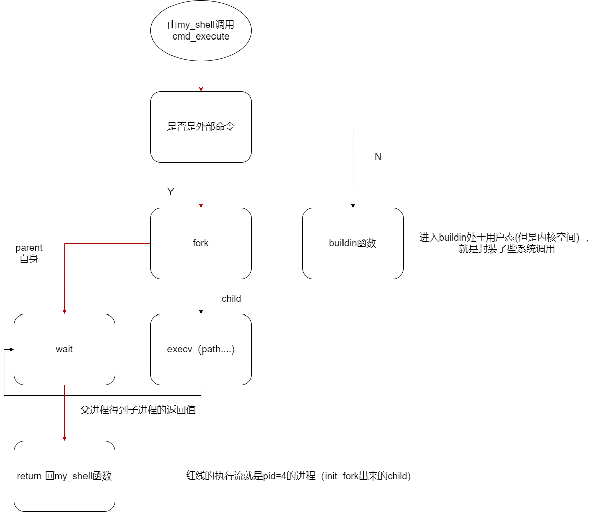